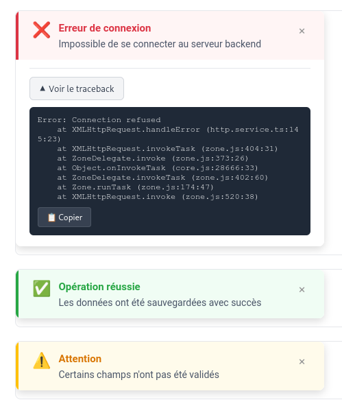

* [OK] (only email for now) Magic link login, this should accept phone number or email in body, and just send email or sms to that phone number or email It should navigte to /verification?token=xxxxxxx we need verfy patient access token , which should return current accesss token and create user if user doesn't exists with that emil or phone nuber

* [OK] patient active conultations, patient closed consultation, one api with (type|status) filter
* [OK] / notifications screen
* [OK] settings, where they can configure notification settings
* [OK] book an apointnmen button, where they can create consultation
they can jump to active consultation screen, means consultation room, and messaging, file shareing
update patient user information

* Add language endpoint /language/<lang_code>/
* Add some field in user
* Add location field
* Add terms models
* Add terms for Users

* On sent action appointement, I would track partitipant
* Add message logic and send link and datetime of appointment
* Add calculated status field for participant (participant : sent, read, accepted)
* Add validation on phone number

* Websocket messages
* edit appointment > reset participant notification status

* Add appointment into consultation patient side
* Send join appointment

## Top priority

* Add dashboard endpoint for both doctor and patient
    - Next appointment
    - Up coming appointment
    - Overdue consultation

* New consultation
    1 - Select beneficiary + reason + description
    2 - Owner is either Team or Doctor group or owned_by
    3 - Improve appointment creation
        <!-- - handling dont_invite_beneficiary, dont_invite_practitionner and dont_invite_me -->
        - check there is at least two participants
        - change button "add participant" and having Existing user selected by default
        - remove feedback_rate and feedback_message
        - use timezone, communication_method and preferred_language

* Consultation overview
    - Edit should have modal or inline edit, not back to wizard
    - Merge Edit and Manage participant button and modal, participants can be manage on the right.

* Handling user timezone

<!-- * Participant delete causing many problem : Notification if participant has been deleted, message rending is not working anymore. -->

## Low priority

* Join consultation : add intermediate page similar to google meet.
* Health Metric : add custom fields on patient + on health metric + endpoints
<!-- * Remove delete appointment -->
check permission for /dashboard

## Add filter patient (user) to only have doctor

## Permission check
No permission (=patient) but : can still go own appointment or group appointment

# Role improvement (Olivier)

- add role doctor (default = patient)
- consultation owner must not be patient (role =doctor)

# Consultation

- add consultation filter (owned by, group, mine)
- Add owner column + group in consultation table

# Terms

- Add realonly model view for terms (by id) (Olivier)
- Add term select = patient or practitioner
- Show term page :
    - for practitioner, must have company + default terms configured, show terms if not the same, update into accepted_term field
    - for patient, must get term data (id + content, new endpoint) and show if id not same than accepted_term field

# Appointement

- move consultation user into participant area (not under tickbox) (Gor)
- on appointment calendar, click must bring to consultation detail.

# Toast

- Add toast with title, description (details or error if backend give)
- Add traceback with detail and copy button in case of error (Gor)

# Misc

<!--- Add register endpoint, but can be disable from .env file (Olivier)-->
<!--- Add openid authentication (Olivier)-->
<!--- Patient dashboard : having next appointment on top-->
- Remove Review button on Dashboard (click on line is enough)
- Remove resume button on consultation list (click on line is enough)
- Remove arrow on Patient page list (click on line is enough)
- Websocket, add event when somebody join appointment, have ring page (Accept or later)
- Implement system message in backend in consultation, to log system event, created_by will be empty

- specialities/id/doctors/ is not returning full image path for picture
- permissions : doctor without permission should see dashboard and consultation
<!-- - on notificaton create, send websocket message also. -->
<!-- - add terms view by ID -->
- User messages for patient is giving 404 not found
- picture on reason is not correct, fix for debug mode
- patient will be redirected to patient app if login in doctor app

- online status is not properly updated in consultations detail for participant
- think about patient terms
- consultations list search is not working
- dashboard overdue consultations is missing profile picture full path
- after openid login everything is 403 except for dashboard end-point
- getting 403 on consultation messages in patient app
- add ability to override backend translations
- test sms and preferred communication method
- dashboard is returning no appointment for patient, but you can join practitioner, and patient is receiving call 
- add a way to send link again, get link for temporary participant

