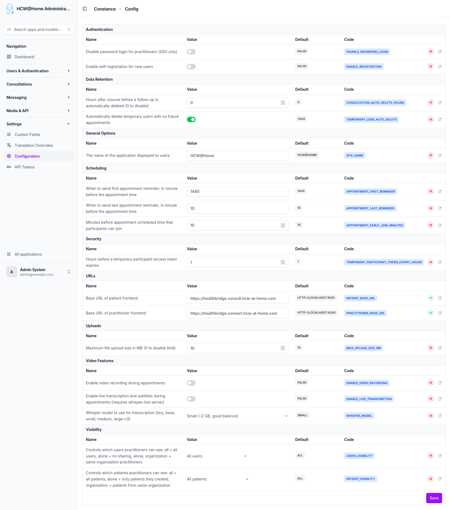
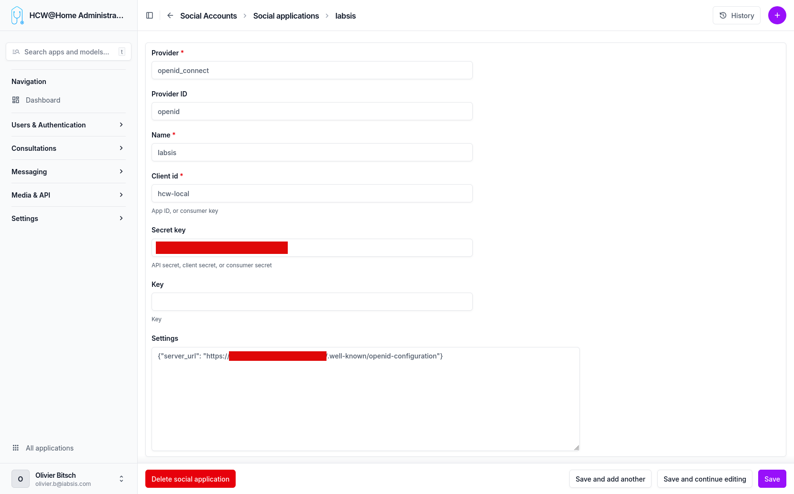

# Advanced Options

The advanced configuration section provides fine-grained control over platform behavior.

> **Menu:** Settings > Configuration

## Authentication

| Option | Code | Default | Description |
|--------|------|---------|-------------|
| Disable password login for practitioners (SSO only) | `DISABLE_PASSWORD_LOGIN` | FALSE | When enabled, practitioners can only log in through the configured SSO provider. The standard email/password form is hidden. |
| Enable self-registration for new users | `ENABLE_REGISTRATION` | FALSE | When enabled, new users can create an account themselves from the login page without an administrator invitation. |

## Data Retention

| Option | Code | Default | Description |
|--------|------|---------|-------------|
| Hours after closure before a follow-up is automatically deleted (0 to disable) | `TEMPORARY_USER_DELETE_HOURS` | 0 | Defines how long a closed follow-up and its associated temporary user are kept before automatic deletion. Set to 0 to disable automatic deletion. |
| Automatically delete temporary users with no future appointments | `TEMPORARY_USER_AUTO_DELETE` | FALSE | When enabled, temporary patient accounts that have no upcoming appointments are automatically removed. |

## General Options

| Option | Code | Default | Description |
|--------|------|---------|-------------|
| The name of the application displayed to users | `SITE_NAME` | HCW@Home | The application name shown in the interface header, emails, and notifications. |

## Scheduling

| Option | Code | Default | Description |
|--------|------|---------|-------------|
| When to send first appointment reminder, in minutes before the appointment time | `APPOINTMENT_FIRST_REMINDER` | 1440 | First reminder sent to participants before the appointment. Default is 1440 minutes (24 hours). |
| When to send last appointment reminder, in minutes before the appointment time | `APPOINTMENT_LAST_REMINDER` | 10 | Last reminder sent shortly before the appointment starts. Default is 10 minutes. |
| Minutes before appointment scheduled time that participants can join | `APPOINTMENT_EARLY_JOIN_MINUTES` | 10 | How early participants are allowed to join the video room before the scheduled start time. |

## Security

| Option | Code | Default | Description |
|--------|------|---------|-------------|
| Hours before a temporary participant access token expires | `TEMPORARY_PARTICIPANT_TOKEN_EXPIRY_HOURS` | 1 | Defines the lifespan of access tokens for temporary participants (patients invited via link). After expiration, a new link must be generated. |

## URLs

| Option | Code | Description |
|--------|------|-------------|
| Base URL of patient frontend | `PATIENT_BASE_URL` | The public URL where the patient application is hosted (e.g., `https://patient.example.com`). Used to generate invitation links sent to patients. |
| Base URL of practitioner frontend | `PRACTITIONER_BASE_URL` | The public URL where the practitioner application is hosted (e.g., `https://practitioner.example.com`). Used in notification emails sent to practitioners. |

## Uploads

| Option | Code | Default | Description |
|--------|------|---------|-------------|
| Maximum file upload size in MB (0 to disable limit) | `MAX_UPLOAD_SIZE_MB` | 10 | Maximum allowed file size for uploads in chat and consultations. Set to 0 to allow unlimited file sizes. |

## Video Features

| Option | Code | Default | Description |
|--------|------|---------|-------------|
| Enable video recording during appointments | `ENABLE_VIDEO_RECORDING` | FALSE | When enabled, video consultations can be recorded and stored on the configured S3-compatible storage. |
| Enable live transcription and subtitles during appointments | `ENABLE_LIVE_TRANSCRIPTION` | FALSE | Enables real-time speech-to-text subtitles during video calls. Requires a Whisper live server to be configured and running. |
| Whisper model to use for transcription | `WHISPER_MODEL` | small | The Whisper AI model used for live transcription. Available sizes: tiny, base, small, medium, large-v3. Larger models are more accurate but require more resources. |

## Visibility

| Option | Code | Default | Description |
|--------|------|---------|-------------|
| Controls which users practitioners can see | `USERS_VISIBILITY` | ALL | Defines practitioner visibility scope. `all`: all users, `alone`: no sharing, `organization`: only practitioners from the same organization. |
| Controls which patients practitioners can see | `PATIENT_VISIBILITY` | All patients | Defines patient visibility scope. `all`: all patients, `alone`: only patients they created, `organization`: patients from the same organization. |

## Patient Management

| Option | Code | Default | Description |
|--------|------|---------|-------------|
| Force all newly created patients to be temporary users | `FORCE_TEMPORARY_PATIENTS` | FALSE | When enabled, every newly created patient is forced to be a temporary user (no permanent patient accounts). The `temporary` toggle in the patient creation modal is locked on. Existing permanent patients are not converted and can still be edited without changing their status. The "Patients" menu entry is hidden from the practitioner sidebar, and on the patient app the self-registration page and password login are disabled — only magic-link access remains. Sending `temporary=false` to the API returns HTTP 400. |

## SSO Configuration

OpenID Connect (SSO) can be configured to delegate authentication to an external identity provider (Keycloak, Azure AD, etc.). Practitioners log in via the "Sign in with..." button, and accounts are automatically created on first login.

