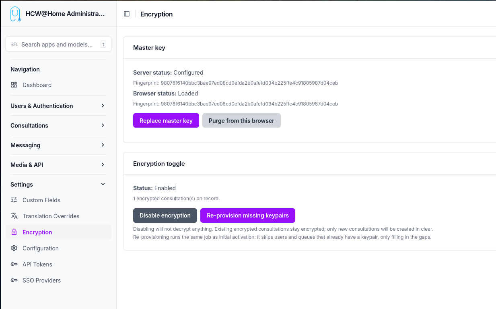

# End-to-End Encryption

HCW@Home can encrypt the **content of follow-ups** (chat messages and attachments) so that the server only ever stores ciphertext. Decryption keys live in the participants' browsers.

> **Menu:** Settings > Encryption

The toggle is platform-wide: once enabled, every new follow-up is created encrypted and the server rejects any attempt to create one in clear.

## What is encrypted

| Item | State when encryption is on |
|------|------------------------------|
| Message text content | **Encrypted** (AES-GCM, base64 in DB) |
| Message attachments | **Encrypted** (AES-GCM blob on disk) |
| Attachment file name and MIME type | **Encrypted** in `encrypted_attachment_metadata` |
| Follow-up title, description, custom fields | In clear |
| Participants (beneficiary, owner, queue) | In clear (relations only) |
| Appointments, reasons, profiles | In clear |
| Video recordings, transcripts | In clear |

This is content-level encryption, not metadata encryption. An operator with database access can see who talked to whom and when, but cannot read the messages.

## How encryption works

### Each follow-up has its own key

Every follow-up is encrypted with a **unique random key** generated in the practitioner's browser the moment the follow-up is created. That key is what actually encrypts every message and every attachment of that follow-up. Two follow-ups never share the same key.

That same key is then **encrypted once for each participant** so that they can decrypt it later. There are five participants per encrypted follow-up:

- the **patient** (`beneficiary`)
- the **assigned practitioner** (`owned_by`)
- the **creator** (`created_by`)
- the **queue** the follow-up belongs to
- the **master key** (platform recovery)

When the follow-up is saved, the server receives only the encrypted versions of the key — one per participant — and stores them alongside the follow-up. The clear key never leaves the browser. The server therefore holds the encrypted messages, the encrypted copies of the follow-up key, but nothing it can decrypt by itself.

### Personal keys, encrypted with a passphrase

To decrypt their copy of the follow-up key, every user needs a **personal private key**. This key is generated server-side the first time encryption is enabled (or when a new user is created afterwards). Before being stored on the server, it is itself encrypted with a passphrase that only the user knows.

The passphrase is generated once at provisioning time and sent to the user through their declared communication channel (email, SMS, WhatsApp, or to their creating practitioner when the patient is in *manual* contact mode). It is **never stored** on the server.

When a user logs in for the first time after encryption is enabled, they enter their passphrase once. The server returns their encrypted private key, the browser unlocks it locally and keeps the unlocked key in the browser's secure storage (IndexedDB, marked non-extractable). On subsequent logins from the same browser, no passphrase is needed.

### Queue keys, shared by every member

A queue has a single private key, generated server-side at provisioning. That key is **encrypted once for every member** of the queue, and once more for the master key. When a member is added or removed later, only their encrypted copy is added or deleted — the queue key itself does not change, so existing follow-ups remain readable by all current members.

Because the queue key is itself a few kilobytes large, it cannot be encrypted directly with a single asymmetric operation. The platform uses **envelope encryption** internally: a fresh symmetric key encrypts the queue key, and that small symmetric key is encrypted for each recipient. This is invisible to the admin — the only consequence is that wrapping the queue key for a new member requires the master key (held only in the admin's browser).

### What the server can and cannot see

The server can see who participates in which follow-up, when messages are exchanged, and the size of each message — that's the metadata. The actual content of messages, attachment file names, and attachment bodies are **encrypted blobs** the server cannot read.

There is no backdoor. If every personal passphrase, every browser copy, and the master key are all lost simultaneously, the data is permanently unreadable.

## Enabling encryption

1. **Generate the master key** — Click *Generate master key* on the Encryption settings page. Your browser:
    - Generates an RSA-4096 keypair locally.
    - Downloads `master-private-key.pem` automatically (your offline backup).
    - Stores the same key non-extractable in this browser's IndexedDB (`hcw-master-key`).
    - Uploads only the public key to the server.

    Keep the `.pem` file safe (password manager, sealed envelope). The server never sees the private master key, and no one can decrypt the recovery envelope without it.

2. **Enable encryption** — Click *Enable encryption*. A background job is dispatched that:
    - Generates a keypair for every active user (with a random passphrase emailed/SMSed/handed to the practitioner of manual-contact patients).
    - Generates a keypair for every queue, wrapped for the master and for each member.

3. **Users activate their key** — At their next login, every user is forced through `/activate-encryption` and must enter the passphrase they received. The browser pulls the encrypted private key from the server, decrypts it, and stores it non-extractable in IndexedDB.

After this, all new follow-ups are encrypted automatically and existing users can read their messages.

## Browser status

The Encryption settings page shows two statuses:

- **Server status** — Whether the master public key is configured server-side, with its fingerprint.
- **Browser status** — Whether the master private key is loaded in *this* browser's IndexedDB, with verification that the fingerprint matches the server's.

If a different admin needs to manage queue memberships from another machine, they can click *Import master key (.pem) into this browser* and select the backup `.pem` file. The browser does a functional encrypt/decrypt round-trip with the server's public key to verify the keypair before storing it non-extractable.

## Adding users to a queue

When you add a user to a queue from the queue admin page, the page contains JavaScript that:

1. Reads the queue's `encrypted_queue_private_key_master` from the form.
2. Reads the master private key from this browser's IndexedDB.
3. Decrypts the queue private key (envelope decryption, in memory).
4. Fetches the new member's public key from the server.
5. Re-wraps the queue private key for that member's pubkey.
6. Fills the hidden `encrypted_queue_private_key` field on the membership row.
7. Submits the form normally.

The server never sees the queue private key in clear during this operation. **The admin must have imported the master key in this browser** (see the Encryption settings page).

## Recovering from a lost passphrase

A user who has forgotten their passphrase can click *I forgot my passphrase* on the activation screen. The server generates a brand-new keypair and returns the new passphrase one time. The user keeps access to all messages going forward, but loses access to messages encrypted under the previous public key until a colleague (or the admin via the master key) rewraps each follow-up's symmetric key for the new public key. A "Resync key" banner is shown to colleagues on affected follow-ups.

The master recovery envelope is the safety net: even if every user keypair is lost, the admin who holds the master `.pem` can decrypt every follow-up by importing the master key in their browser and using a recovery flow (out of scope of v1, mechanism documented for the future).

## Disabling encryption

Disabling the platform toggle does **not** decrypt anything. Existing encrypted follow-ups remain encrypted and readable by users who hold their key; new follow-ups are created in clear. To bring older follow-ups back online for a new device, the user simply re-imports their key (same passphrase).

## Re-provisioning missing keypairs

If a user or queue was created before encryption was enabled — or if a worker error skipped one — click **Re-provision missing keypairs** on the Encryption settings page. The job is idempotent: it only fills in the gaps for users and queues whose `public_key` is null.

## Limitations

- **History migration** is out of scope. Messages sent before activation stay in clear in their (unencrypted) follow-ups.
- **Queue key rotation** is manual: there is no automatic rotation if a member leaves. They keep access to past follow-ups until the queue is regenerated.
- **Server fingerprint validation** of envelopes is not enforced — a malicious client could store fake fingerprints. This does not break confidentiality, only the desync banner UX.
