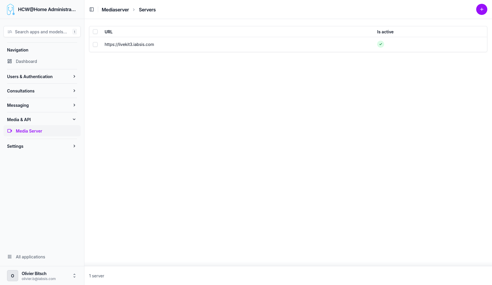

# Media Servers

Media servers handle the video and audio conferencing infrastructure for consultations.

> **Menu:** Media & API > Media Server

## Configuration

Each media server entry defines a LiveKit server instance used for WebRTC-based video/audio calls. Multiple media servers can be configured for load balancing or geographic distribution.

The configuration includes:

- Server URL
- API key and secret
- Assignment to specific organizations
