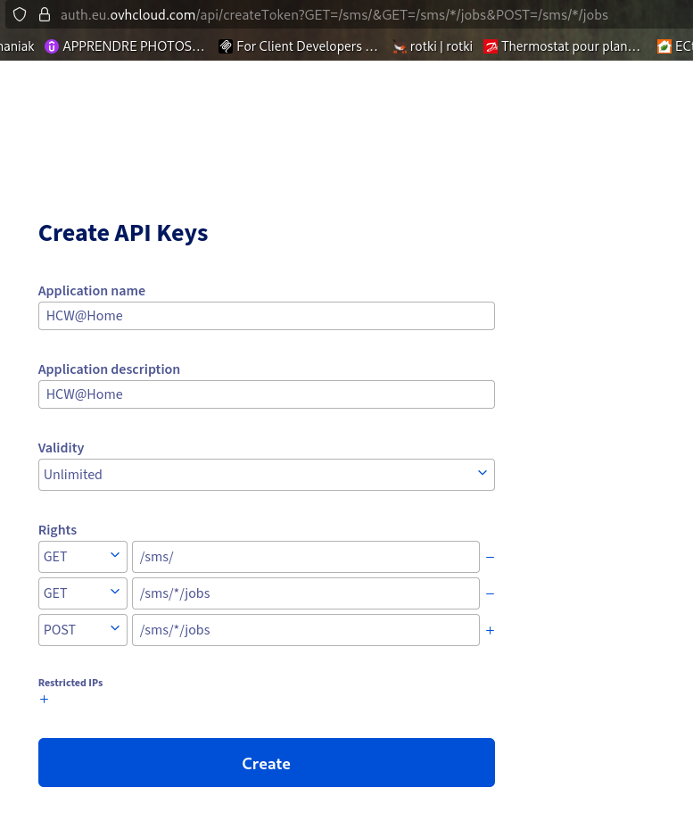
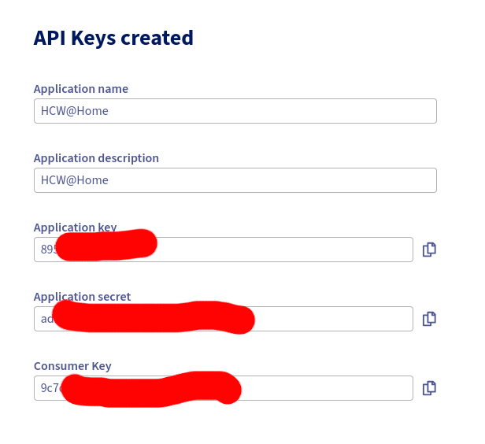

# Messaging Providers

Messaging providers are used to send notifications, invitations, and reminders to patients and practitioners.

> **Menu:** Messaging > Messaging providers


## Email

An SMTP provider can be configured to send emails (invitations, appointment reminders, password reset, etc.).

## SMS

An SMS gateway can be configured to send SMS notifications to patients who do not have an email address or for urgent reminders.

### OVH SMS

To send SMS through OVH, you first need an OVH SMS account, then an API token (application key, application secret and consumer key) authorized for the SMS endpoints.

#### 1. Create the API token

Open the following URL while logged in to your OVH account. It pre-fills the **exact** access rules the integration needs:

```
https://auth.eu.ovhcloud.com/api/createToken?GET=/sms/&GET=/sms/*/jobs&POST=/sms/*/jobs
```

!!! warning "Access rules must match exactly"
    OVH matches token access rules on the exact path. The integration calls `GET /sms` (list services) and `POST /sms/{service}/jobs/` (send), so the token **must** be granted `GET /sms/`, `GET /sms/*/jobs` and `POST /sms/*/jobs`. A token granted only `GET /sms` (or with a different path) returns `403 NOT_GRANTED_CALL`.

On the token creation page:

- The **Application name** and **Application description** are free text — they only help you identify what the key is used for.
- Set **Validity** to **Unlimited**, otherwise the token will stop working after the expiry date.



!!! danger "Copy the credentials immediately"
    After validation, OVH shows the **Application Key**, **Application Secret** and **Consumer Key** **only once**. Copy all three before leaving the page — they cannot be displayed again afterwards.



#### 2. Fill in the provider in HUG@Home

> **Menu:** Messaging > Messaging providers > add/edit the OVH provider

| Field | Value |
|-------|-------|
| Application key | The *Application Key* from OVH |
| Application secret | The *Application Secret* from OVH |
| Consumer key | The *Consumer Key* from OVH |
| Service name | The SMS service name as shown in OVH (e.g. `sms-xxxxxxx-1`) |
| Sender ID | The registered sender name (see below), or leave empty |

!!! note "Sender ID"
    The **Sender ID** is the name displayed to the SMS recipient. It must be a sender **registered and validated in your OVH account** beforehand — OVH validates senders manually, which can take a few hours.

    If you leave the field **empty**, OVH will send from a **short number** instead of a named sender.

#### 3. Test

Use the **Test connection** action on the provider to verify the credentials and that the configured service name exists in your OVH account.

## WhatsApp

!!! warning
    WhatsApp integration is not yet functional. This feature is planned for a future release.
