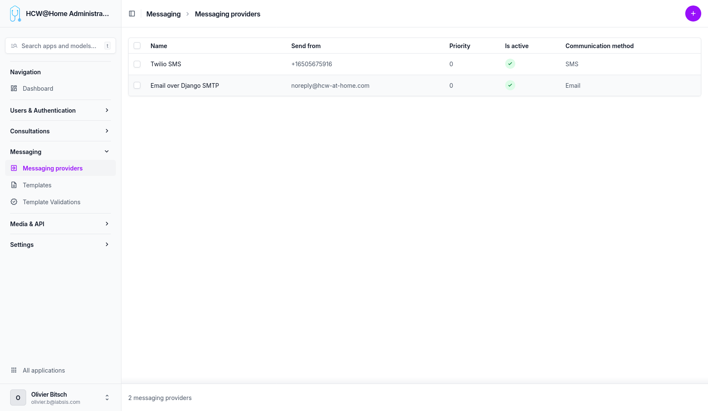

# Messaging Providers

Messaging providers are used to send notifications, invitations, and reminders to patients and practitioners.

> **Menu:** Messaging > Messaging providers

## Email

An SMTP provider can be configured to send emails (invitations, appointment reminders, password reset, etc.).

## SMS

An SMS gateway (e.g., Twilio) can be configured to send SMS notifications to patients who do not have an email address or for urgent reminders.

## WhatsApp

!!! warning
    WhatsApp integration is not yet functional. This feature is planned for a future release.
