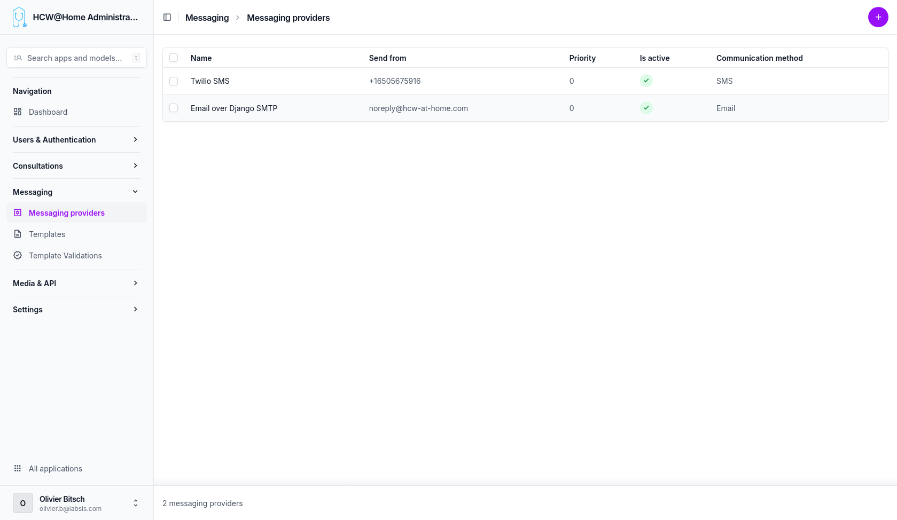
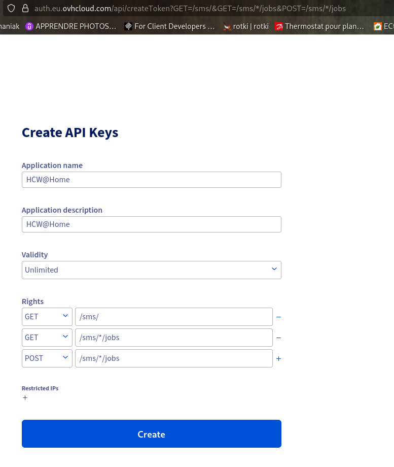
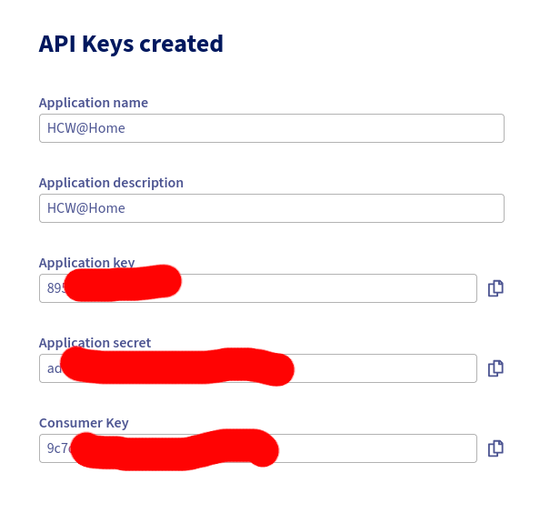

# Messaging Providers

Messaging providers are used to send notifications, invitations, and reminders to patients and practitioners.

> **Menu:** Messaging > Messaging providers



## Email

An SMTP provider can be configured to send emails (invitations, appointment reminders, password reset, etc.).

## SMS

An SMS gateway can be configured to send SMS notifications to patients who do not have an email address or for urgent reminders.

### OVH SMS

To send SMS through OVH, you first need an OVH SMS account, then an API token (application key, application secret and consumer key) authorized for the SMS endpoints.

#### 1. Create the API token

Open the following URL while logged in to your OVH account. It pre-fills the **exact** access rules the integration needs:

```
https://auth.eu.ovhcloud.com/api/createToken?GET=/sms/&GET=/sms/*/jobs&POST=/sms/*/jobs
```

!!! warning "Access rules must match exactly"
    OVH matches token access rules on the exact path. The integration calls `GET /sms` (list services) and `POST /sms/{service}/jobs/` (send), so the token **must** be granted `GET /sms/`, `GET /sms/*/jobs` and `POST /sms/*/jobs`. A token granted only `GET /sms` (or with a different path) returns `403 NOT_GRANTED_CALL`.

On the token creation page:

- The **Application name** and **Application description** are free text — they only help you identify what the key is used for.
- Set **Validity** to **Unlimited**, otherwise the token will stop working after the expiry date.



!!! danger "Copy the credentials immediately"
    After validation, OVH shows the **Application Key**, **Application Secret** and **Consumer Key** **only once**. Copy all three before leaving the page — they cannot be displayed again afterwards.



#### 2. Fill in the provider in HUG@Home

> **Menu:** Messaging > Messaging providers > add/edit the OVH provider

| Field | Value |
|-------|-------|
| Application key | The *Application Key* from OVH |
| Application secret | The *Application Secret* from OVH |
| Consumer key | The *Consumer Key* from OVH |
| Service name | The SMS service name as shown in OVH (e.g. `sms-xxxxxxx-1`) |
| Sender ID | The registered sender name (see below), or leave empty |

!!! note "Sender ID"
    The **Sender ID** is the name displayed to the SMS recipient. It must be a sender **registered and validated in your OVH account** beforehand — OVH validates senders manually, which can take a few hours.

    If you leave the field **empty**, OVH will send from a **short number** instead of a named sender.

#### 3. Test

Use the **Test connection** action on the provider to verify the credentials and that the configured service name exists in your OVH account.

## WhatsApp

WhatsApp messages are sent through **Twilio**. Unlike SMS or email, WhatsApp only accepts
**pre-approved message templates** outside of a 24-hour conversation window opened by the
recipient. Each notification therefore has to be submitted to Meta for approval, per language,
before it can be delivered.

If no approved template is available for a notification, the message is **not** sent over
WhatsApp: the platform falls back to the SMS providers, using the same phone number.

### 1. Set the backend base URL

> **Menu:** Settings > Constance > URLs > **Backend base URL**

This must be the **publicly reachable** URL of this backend. It is used for two things:

- the static base of the WhatsApp button URLs (`https://<backend>/r/<token>`), which redirect the
  recipient to the patient or practitioner application;
- the delivery status webhook Twilio calls back.

!!! warning "Set it before submitting templates"
    The URL is baked into every approved template. Changing it later flags all validations as
    **Content changed**, and they must be submitted again. The same applies to the **site name**,
    which signs the templates that end on a variable.

### 2. Create the provider

> **Menu:** Messaging > Messaging providers > add a provider

| Field | Value |
|-------|-------|
| Name | Twilio WhatsApp |
| Account SID | The Twilio *Account SID* |
| Auth token | The Twilio *Auth Token* |
| From phone | The WhatsApp-enabled Twilio number, e.g. `+14155238886` |

Use the **Test connection** action to verify the credentials.

### 3. Submit the templates for approval

> **Menu:** Messaging > Template validations

1. **Generate WhatsApp validations** creates one entry per notification, language and WhatsApp
   provider.
2. Select the entries and run **Submit templates for validation**. This creates the Twilio Content
   template and sends it to WhatsApp for approval. The *Variable expressions* field then shows which
   template expression each `{{1}}`, `{{2}}`… placeholder stands for.
3. Run **Check validation status** until the status becomes **Validated**. Approval by Meta usually
   takes a few minutes but can take up to 24 hours.

!!! note "Templates rejected by Meta"
    Meta refuses a body that **starts with a variable** or puts **two variables side by side**.
    Templates are checked against these rules *before* submission: a non-compliant template is
    marked **Failed** immediately, with the reason and the offending body in its logs, instead of
    coming back rejected hours later. Adjust the wording under *Messaging > Template overrides*
    and submit again.

    Two cases are handled automatically and need no rewording:

    - a body **ending** on a variable is signed with the site name, since Meta requires static
      text last;
    - two variables separated only by a space are **merged into a single one** (`{{1}}` carrying
      both the first and last name, for instance).

    Jinja conditions are also supported: a whole `...` block becomes one
    variable, resolved when the message is sent.

Whenever a template's text is edited, its validations are flagged **Outdated** and are no longer
used for sending until they have been submitted and approved again.

### 4. Delivery status

Twilio reports delivery progress to `https://<backend>/messaging/twilio/status/<token>`, which the
platform passes with every message. The *Delivered at* and *Read at* fields of
**Messaging > Messages** are filled from these callbacks. The endpoint requires a valid
`X-Twilio-Signature`, so the backend must be reachable from the internet for statuses to progress
beyond *Sent*.
