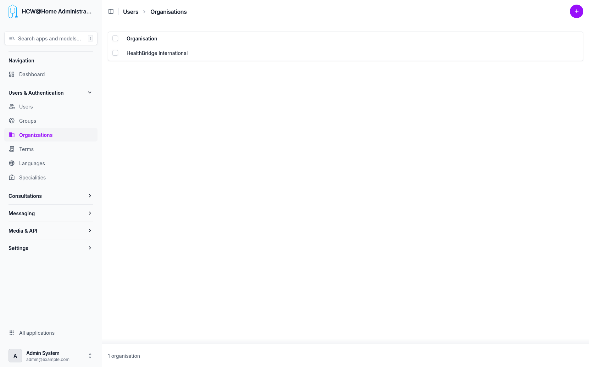

# Organizations

Organizations represent tenants in the platform. Each organization has its own configuration, users, and data isolation.

> **Menu:** Users & Authentication > Organizations

Data isolation between organizations is controlled by two visibility options in the [advanced settings](advanced-options.md):

- **USERS_VISIBILITY**: controls which users practitioners can see (all users, same organization only, or no sharing)
- **PATIENT_VISIBILITY**: controls which patients practitioners can see (all patients, only patients they created, or patients from the same organization)

When set to organization-level isolation, users and consultations are strictly scoped to their organization.

## Organization List

## Default Organization

The default organization has a special behavior: its home page displays the application logs, providing a quick overview of system activity for administrators.

Other organizations display a standard dashboard.

## Organization Configuration

Each organization can be configured independently with:

- Custom branding (logo, colors)
- Terms of use assignment
- Messaging providers (email, SMS)
- SSO/OpenID Connect configuration
- Feature toggles and advanced options
