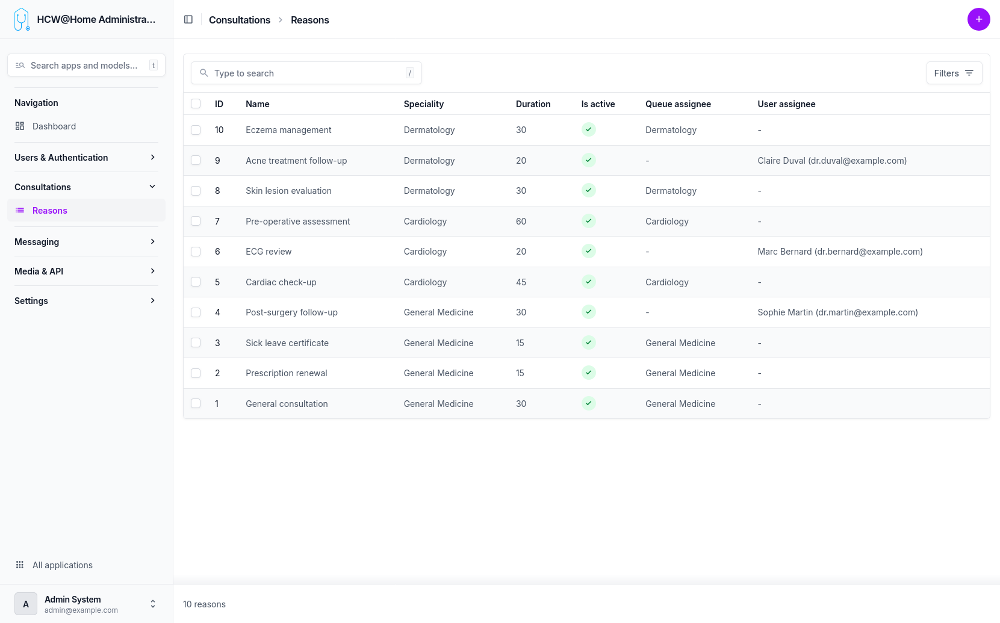
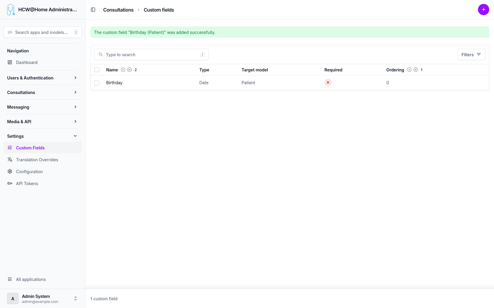

# Consultation Reasons

Consultation reasons are used by patients when requesting an appointment through the booking system. They help route the request to the appropriate practitioner.

> **Menu:** Consultations > Reasons

## How It Works

When a patient books an appointment, they select a reason from the available list. The system then matches the reason with practitioners who have the corresponding specialty configured.

## Prerequisites

For the booking system to work correctly, the following must be in place:

1. **Specialties configured**: each reason is linked to a specialty. The specialty must be created and assigned to the relevant practitioners.
2. **Practitioner availability slots**: practitioners must have defined their availability slots so that patients can see and book open time slots.

Without both of these, the reason will not be available for patient booking.

## Custom Fields

Custom fields can be added to the consultation request form, allowing patients to provide additional information (symptoms, urgency level, etc.) when selecting a reason.

> **Menu:** Settings > Custom Fields

