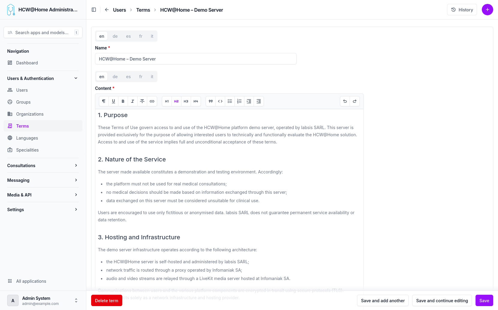

# Terms of Use

Terms of use must be created and then assigned to an organization. Users will be required to accept these terms before using the platform.

> **Menu:** Users & Authentication > Terms

## Creating Terms

Terms are created from the administration interface. Each term entry includes a title, content, and language. Multiple versions can be maintained for different languages.

## Assigning Terms to an Organization

Once created, terms must be configured in the organization settings to become active. Users belonging to that organization will then be prompted to accept the terms on their next login.
