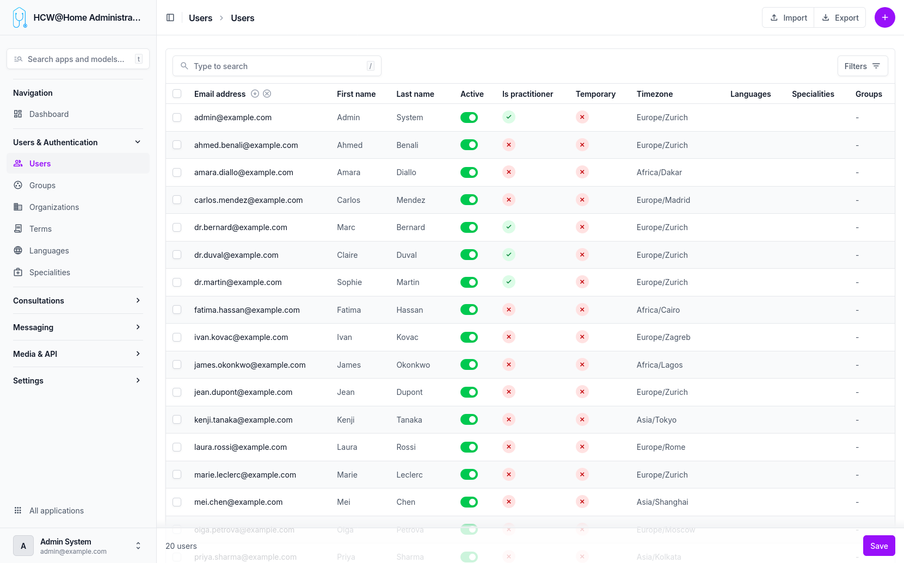
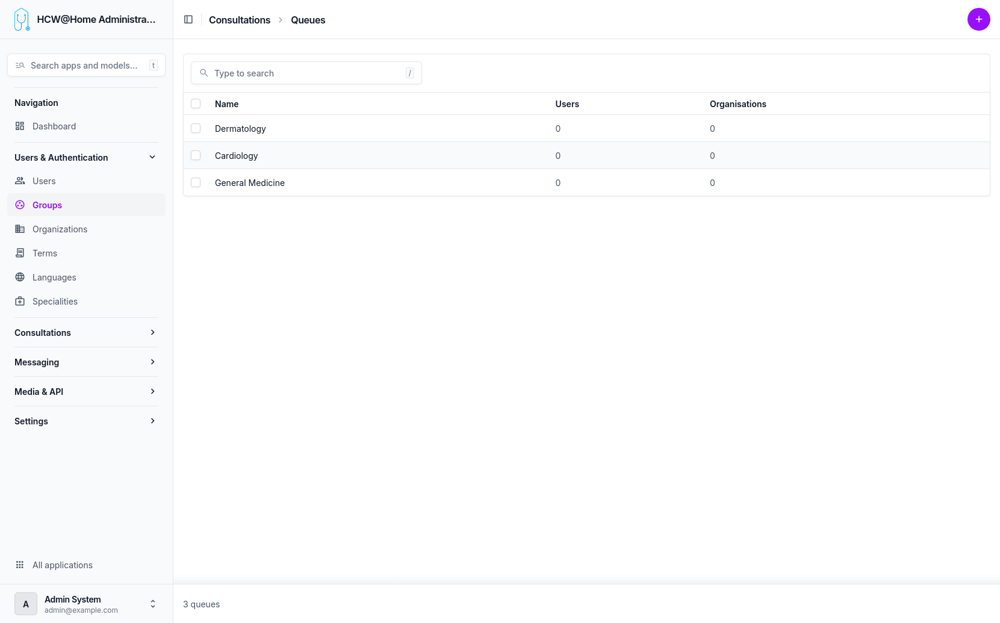

# User Management

Users are managed from the administration interface. Each user belongs to a default organization, which determines their access scope and configuration.

> **Menu:** Users & Authentication > Users

## User List

The user list provides an overview of all registered users with their role, status, and organization.

## Default Organization

Every user is assigned to a default organization upon creation. This organization defines:

- The available features and configuration
- The terms of use the user must accept
- The messaging providers used for notifications

## Groups

> **Menu:** Users & Authentication > Groups

Users can be assigned to one or more groups (e.g., "General Medicine", "Cardiology"). Groups are used to route consultation requests to the appropriate practitioners.

