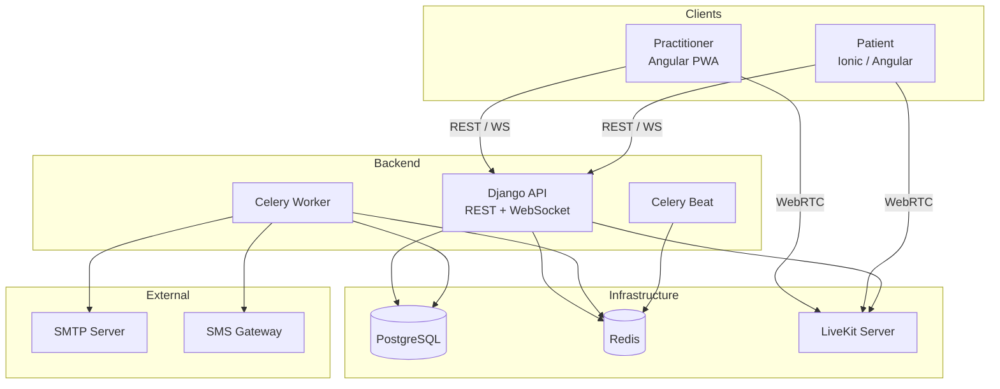

# Architecture

The solution is composed of several services:

| Service | Technology | Description |
|---------|------------|-------------|
| **API / Backend** | Django 5, Django REST Framework, Daphne (ASGI) | REST API, WebSocket, administration |
| **Celery Worker** | Celery | Asynchronous tasks (reminders, cleanup, notifications) |
| **Celery Beat** | Celery Beat | Periodic task scheduler |
| **Practitioner** | Angular 20 (PWA) | Web interface for practitioners |
| **Patient** | Ionic / Angular 20 | Web/mobile application for patients |
| **PostgreSQL** | PostgreSQL 15 | Database (multi-tenant by schema) |
| **Redis** | Redis 7 | Cache and message broker |
| **LiveKit** | LiveKit Server | Video/audio conferencing (WebRTC SFU) |
| **SMTP Server** | Any SMTP | Email delivery (invitations, reminders, notifications) |
| **SMS Gateway** *(optional)* | Twilio, etc. | SMS delivery for patient invitations |

## Overview Diagram

