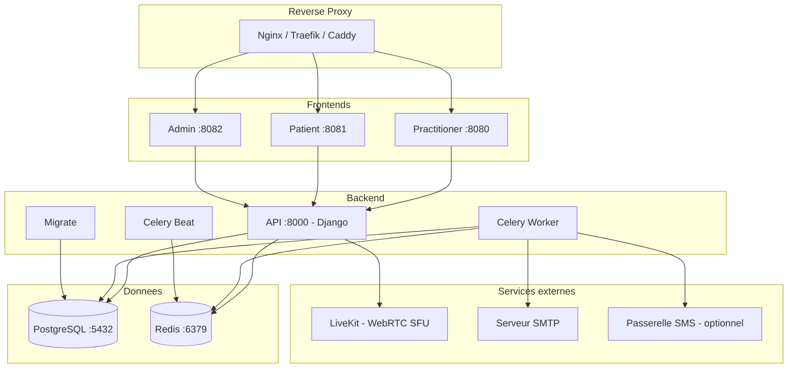

# Deploiement avec Docker Compose

Cette methode deploie l'ensemble des services HCW@Home dans des conteneurs Docker. C'est l'approche recommandee pour le developpement, les tests et les environnements cloud.

## Prerequis

- Docker Engine 20+ et Docker Compose v2
- 2 Go de RAM minimum
- Un nom de domaine (production) ou `localhost` (developpement)

## Architecture des services



## Mise en place rapide

### 1. Recuperer le fichier docker-compose

```bash
wget https://raw.githubusercontent.com/HCW-home/hcw/refs/heads/master/docker-compose.yml
```

### 2. Configurer l'environnement

Recuperer les images :

```bash
TAG=0.10.0 docker compose pull
```

!!! warning "Securite"
    Ne jamais utiliser les valeurs par defaut de `DJANGOSECRET_KEY` en production. Generez une cle avec : `echo -n "votre phrase secrete" | sha256sum`

### 3. Lancer les services

```bash
docker compose up -d
```

Au premier lancement, le service `migrate` applique automatiquement les migrations de base de donnees.

### 4. Creer un tenant

HCW@Home utilise le multi-tenancy avec isolation par schema PostgreSQL. Chaque tenant possede ses propres donnees, utilisateurs et configuration. Les tenants sont crees via le shell Django.

```bash
docker compose exec api python3 manage.py create_tenant
```


* **schema name** : localhost
* **name** : localhost
* **domain** : 127.0.0.1

```bash
docker compose exec api python3 manage.py tenant_command createsuperuser -s localhost
```

!!! tip "Plusieurs tenants"
    Repetez ce processus pour chaque organisation. Chaque tenant est completement isole : utilisateurs, consultations, configuration et branding separes.

### 5. Charger les donnees de test (optionnel)

```bash
docker compose exec api python manage.py loaddata initial/TestData.json
```

Cela cree des utilisateurs de test (mot de passe : `Test1234`). Voir le [README](https://github.com/HCW-home/hcw-home) pour la liste complete.

## Services et ports

| Service | Port expose | Description |
|---------|-------------|-------------|
| **practitioner** | 8080 | Interface praticien (Angular) |
| **patient** | 8081 | Interface patient (Ionic) |
| **admin** | 8082 | Interface d'administration Django |
| **api** | interne | API REST + WebSocket (Daphne) |
| **celery** | - | Worker pour les taches asynchrones |
| **scheduler** | - | Planificateur de taches (Celery Beat) |
| **db** | interne | PostgreSQL 15 |
| **redis** | interne | Redis 7 |

## Volumes persistants

Les donnees sont stockees dans le dossier `./data/` :

| Chemin | Contenu |
|--------|---------|
| `./data/postgres_data/` | Donnees PostgreSQL |
| `./data/redis_data/` | Donnees Redis |
