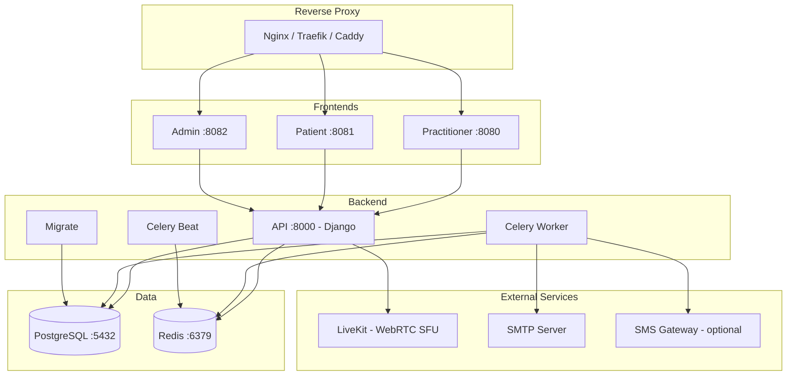

# Deployment with Docker Compose

This method deploys all HCW@Home services in Docker containers. It is the recommended approach for development, testing, and cloud environments.

## Prerequisites

- Docker Engine 20+ and Docker Compose v2
- Minimum 2 GB RAM
- A domain name (production) or `localhost` (development)

## Service Architecture



## Quick Start

### 1. Clone the repository

```bash
wget https://raw.githubusercontent.com/HCW-home/hcw/refs/heads/master/docker-compose.yml
```

### 2. Configure the environment

Copy the configuration file:

```bash
TAG=0.10.0 docker compose pull
```

!!! warning "Security"
    Never use the default values for `DJANGOSECRET_KEY` in production. Generate a key with: `echo -n "your secret phrase" | sha256sum`

### 3. Start the services

```bash
docker compose up -d
```

On first launch, the `migrate` service automatically applies database migrations.

### 4. Create a tenant

HCW@Home uses multi-tenancy with PostgreSQL schema isolation. Each tenant has its own data, users, and configuration. Tenants are created via the Django shell.

```bash
docker compose exec api python3 manage.py create_tenant
```


* **schema name**: localhost
* **name**: localhost
* **domain**: 127.0.0.1

```bash
docker compose exec api python3 manage.py tenant_command createsuperuser -s localhost
```

!!! tip "Multiple tenants"
    Repeat this process for each organization. Each tenant is fully isolated: separate users, consultations, configuration, and branding.

### 5. Load test data (optional)

```bash
docker compose exec api python manage.py loaddata initial/TestData.json
```

This creates test users (password: `Test1234`). See the [README](https://github.com/HCW-home/hcw-home) for the full list.

## Services and Ports

| Service | Exposed Port | Description |
|---------|-------------|-------------|
| **practitioner** | 8080 | Practitioner interface (Angular) |
| **patient** | 8081 | Patient interface (Ionic) |
| **admin** | 8082 | Django admin interface |
| **api** | internal | REST API + WebSocket (Daphne) |
| **celery** | - | Asynchronous task worker |
| **scheduler** | - | Task scheduler (Celery Beat) |
| **db** | internal | PostgreSQL 15 |
| **redis** | internal | Redis 7 |

## Persistent Volumes

Data is stored in the `./data/` directory:

| Path | Content |
|------|---------|
| `./data/postgres_data/` | PostgreSQL data |
| `./data/redis_data/` | Redis data |

