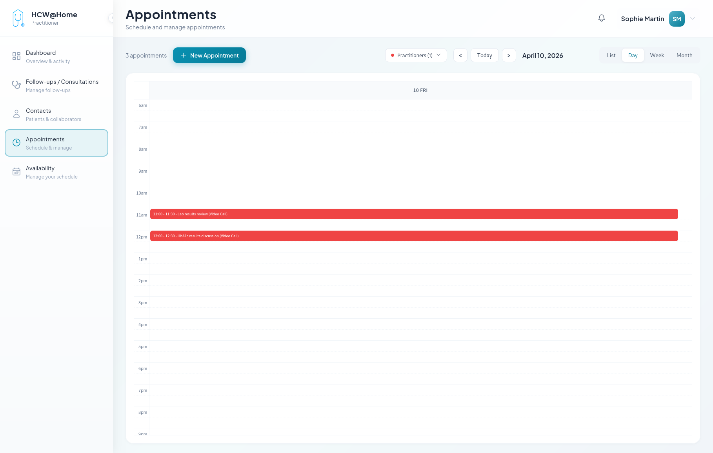
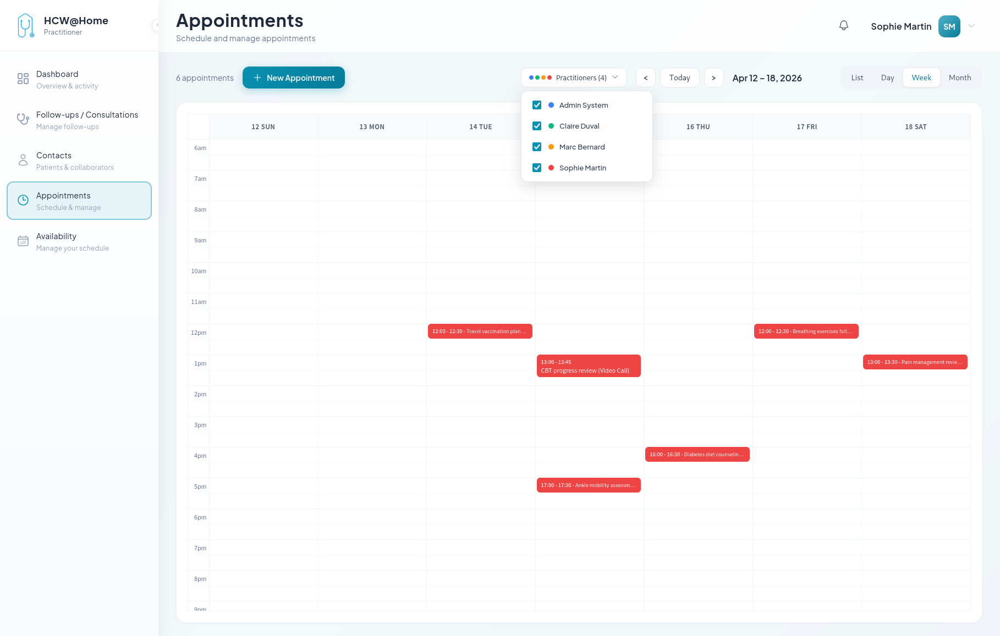

# Appointment Management

A practitioner schedules consultations at specific dates and times with one or more participants.

## Scheduled Appointment

**Typical flow:**

1. The practitioner creates an appointment from the calendar
2. They select the type: online (video) or in-person
3. Invited participants receive an automatic reminder (configurable: 24h before, 10 min before, etc.)
4. At the appointment time, each participant joins the video room
5. The practitioner can record the session if needed

**Features used:** calendar, automatic reminders, multi-participant video, session recording (S3).

## Multi-participant Consultation

Multiple practitioners and/or guests participate in the same consultation.

**Typical flow:**

1. The practitioner creates an appointment and adds multiple participants (colleagues, specialists, interpreters)
2. Each participant receives an invitation
3. Everyone joins the same video conference room
4. Screen sharing is available for presenting documents

**Features used:** multi-participant consultations, screen sharing, group chat.

