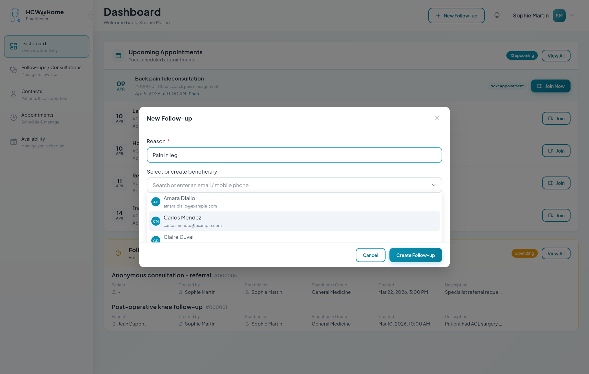
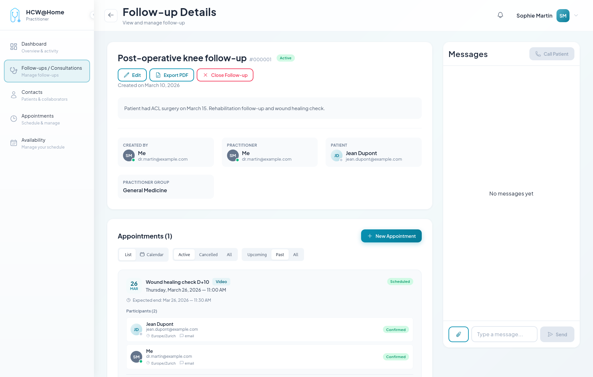
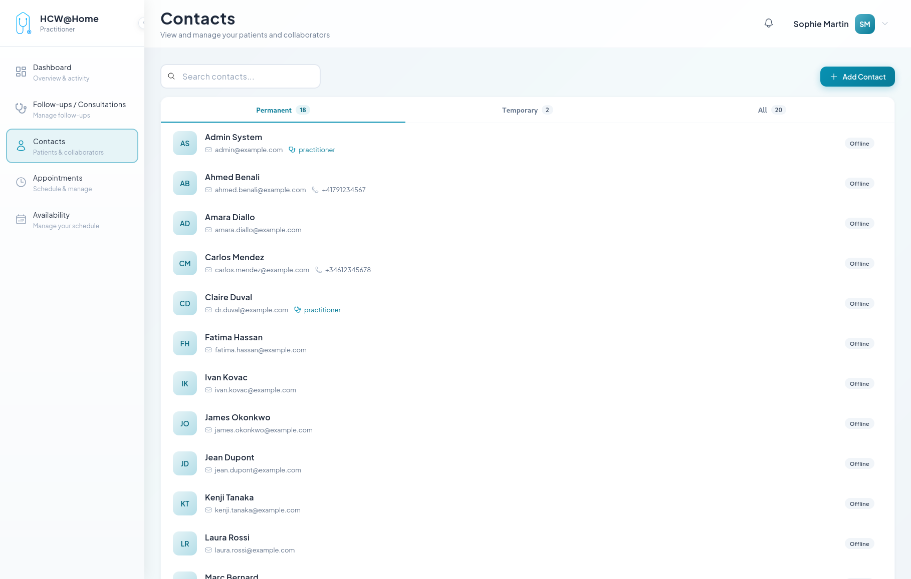

# Follow-up and Exchange Chat with Patient

Practitioners maintain ongoing communication with patients through follow-up consultations and secure messaging.

## Creating a Follow-up

**Typical flow:**

1. The practitioner creates a new follow-up from the contact list
2. The patient receives an invitation via SMS or email
3. The practitioner and patient exchange messages, files, and images via real-time chat
4. The practitioner can schedule appointments within the follow-up
5. Documents and prescriptions can be shared securely

**Features used:** real-time chat, file sharing, ClamAV antivirus, PDF report generation.

## Follow-up Details

The practitioner can review the full history of exchanges with the patient, including messages, shared files, and past appointments.

## Contact List

All active follow-ups are accessible from the contact list, allowing practitioners to quickly resume conversations.

