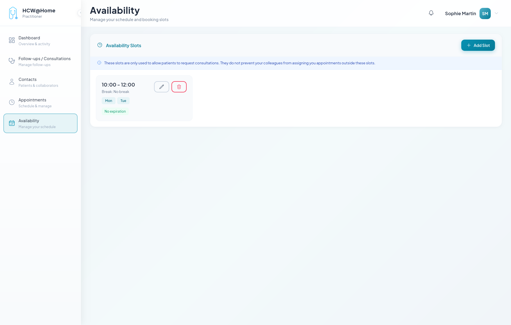
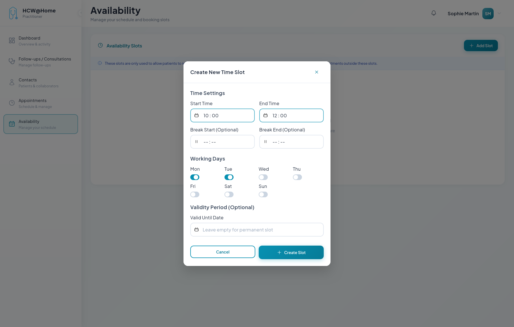

# Slot Booking

Practitioners define their availability so that appointments can be booked on open time slots.

## Defining Availability

**Typical flow:**

1. The practitioner configures their weekly availability with recurring time slots
2. Available slots are visible when scheduling appointments
3. Other practitioners or patients can book on the available slots

**Features used:** availability management, booking slots, calendar integration.

## Opening a Time Slot

The practitioner can open specific time slots for booking, defining the duration and type of appointment accepted.

