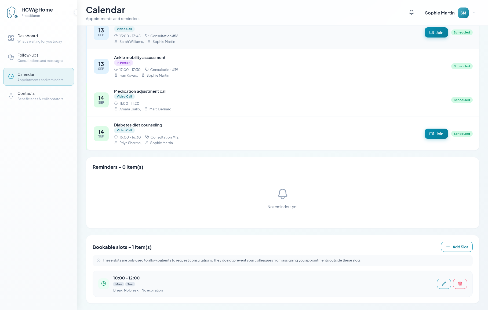
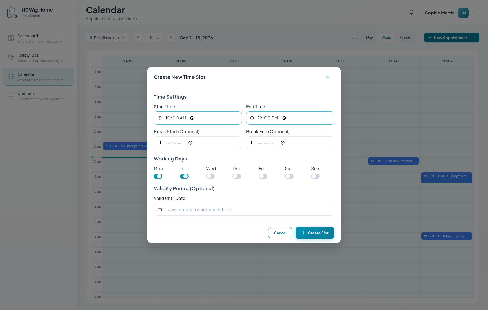

# Slot Booking

Practitioners define their availability so that appointments can be booked on open time slots.

## Defining Availability

**Typical flow:**

1. The practitioner configures their weekly availability with recurring time slots
2. Available slots are visible when scheduling appointments
3. Other practitioners or patients can book on the available slots

**Features used:** availability management, booking slots, calendar integration.

Bookable slots are managed from the **Calendar** menu: they are listed in the
list view, below the appointments and the reminders.

## Opening a Time Slot

The practitioner opens a slot from the arrow next to **+ New Appointment**, then
**New bookable slot**: start and end time, an optional break, the working days
it applies to, and an optional expiry date.

