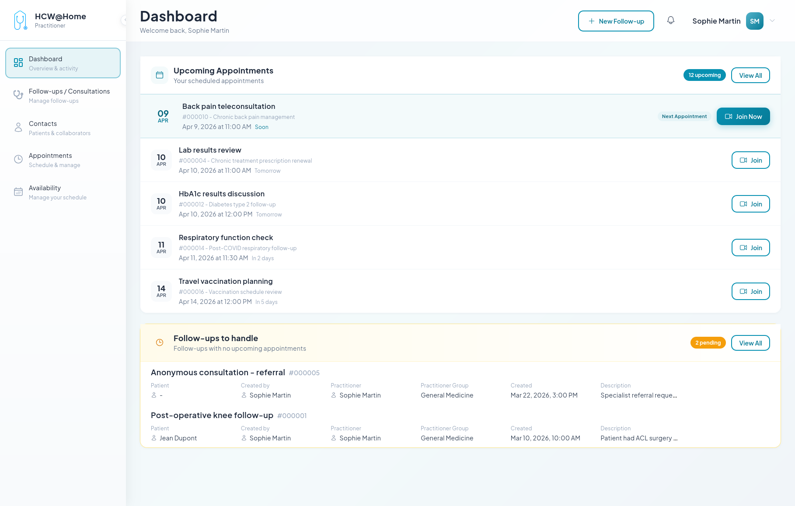

# Video Call Scheduling

A practitioner initiates or schedules video and audio calls with patients.

## Spontaneous Consultation (chat + call)

**Typical flow:**

1. The practitioner creates a new consultation from their interface
2. The patient receives an invitation via SMS or email with an access link
3. The patient accesses the interface via their browser (no installation required)
4. Practitioner and patient exchange via chat (messages, files, images)
5. The practitioner initiates a video or audio call
6. The patient receives the call notification and joins the consultation
7. The practitioner closes the consultation when finished

**Features used:** real-time chat, audio/video calls, file sharing, push notifications, SMS/email invitations.

## Anonymous Patient Invitation

A patient without an account is invited for a one-time teleconsultation.

**Typical flow:**

1. The practitioner creates a consultation and generates an invitation link
2. The link is sent via SMS or email to the patient
3. The patient accesses the consultation via their browser, without creating an account
4. After the consultation, the temporary account is automatically deleted (configurable)

**Features used:** temporary users, link invitations, auto-cleanup.

