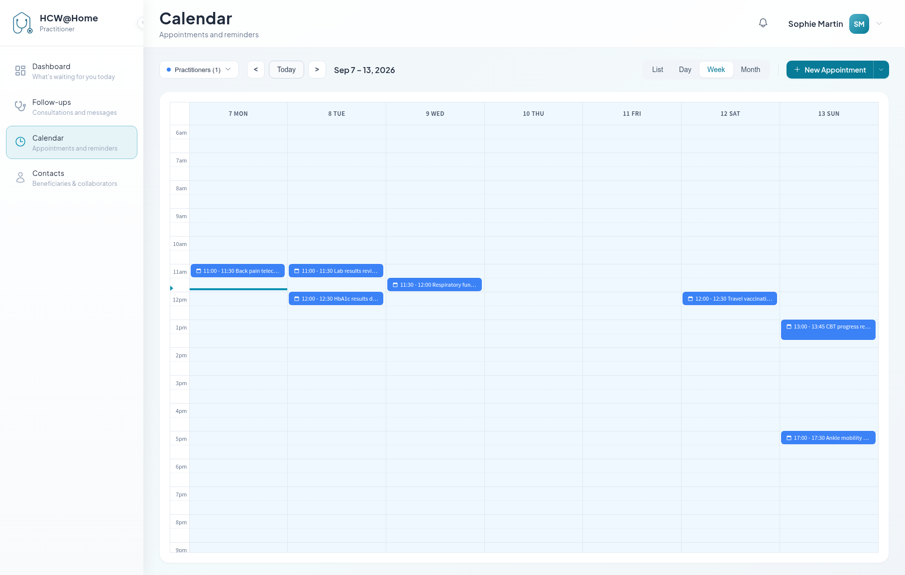

# Appointments and Calendar

The **Calendar** menu shows everything scheduled: appointments, reminders and
bookable slots.

## Change the view

The **List**, **Day**, **Week** and **Month** buttons switch layouts. **Today**
and the `<` `>` arrows move through time.

- **List** — three sections one after the other: appointments, reminders and
  bookable slots, each with its own count
- **Day / Week / Month** — the classic calendar grid. Hovering an entry shows
  its details: type, participants, related follow-up

The **Practitioners** filter overlays a colleague's schedule onto yours — useful
before proposing a slot on their behalf.

## Create from the calendar

**+ New Appointment** creates an appointment directly. The small arrow next to
it opens the other creation actions:

- **New Appointment**
- **New Reminder**
- **New bookable slot**

!!! tip "Prefer creating from a follow-up"
    An appointment created here without a follow-up has no shared chat and no
    PDF export. The platform does attach a temporary follow-up to it so the
    appointment chat works, but that file closes on its own shortly after the
    meeting. For any real care relationship, create the appointment from within
    a follow-up.

## Act on an appointment

Each entry in the list carries its own actions:

- **Join** — enter the video room, once the join window has opened
- **Confirm Presence** — confirm your attendance when you are asked to
- **Mark as completed** / **Mark as no show** — override the automatic outcome
  on a past appointment
- the **Consultation #…** link — jump to the related follow-up, where you can
  edit or cancel the appointment

## Reminders

A reminder sends a message to a contact at a chosen date and time — no meeting,
no video room. Typical uses: a medication reminder, a lab test to book, a
check-in.

1. **+ New Appointment > New Reminder**
2. Pick the **Recipient**, write a **Title** and a **Description**
3. Set the **Date** and **Time**
4. For a repeating reminder, tick **Recurring reminder** and set the interval
   (every *n* days, weeks or months) and the number of occurrences

At the scheduled moment the contact receives it by SMS or email, depending on
their configured channel. Reminders can be edited or deleted from the calendar.

## Automatic reminders

Appointment participants also receive reminders without you doing anything: one
well in advance (24 hours by default) and one just before the start (10 minutes
by default). Your administrator sets these delays.

Depending on the configuration, participants may also be asked to **confirm
their presence**; their answer shows up on the participant list as *Confirmed*,
*Pending* or *Declined*.

## Bookable slots

A bookable slot declares a window during which patients may **request** a
consultation with you.

1. Open the arrow next to **+ New Appointment** and choose **New bookable slot**
2. Set the **Start Time** and **End Time**
3. Optionally set a **Break Start** and **Break End**
4. Tick the **Working Days** the slot applies to
5. Optionally set a **Valid Until** date — leave it empty for a permanent slot

Your slots are listed in the **List** view, under the appointments and the
reminders, and can be edited or deleted from there.

!!! note
    These slots only drive patient-initiated requests. They do not block your
    calendar, and they do not stop a colleague from booking you outside of them.
