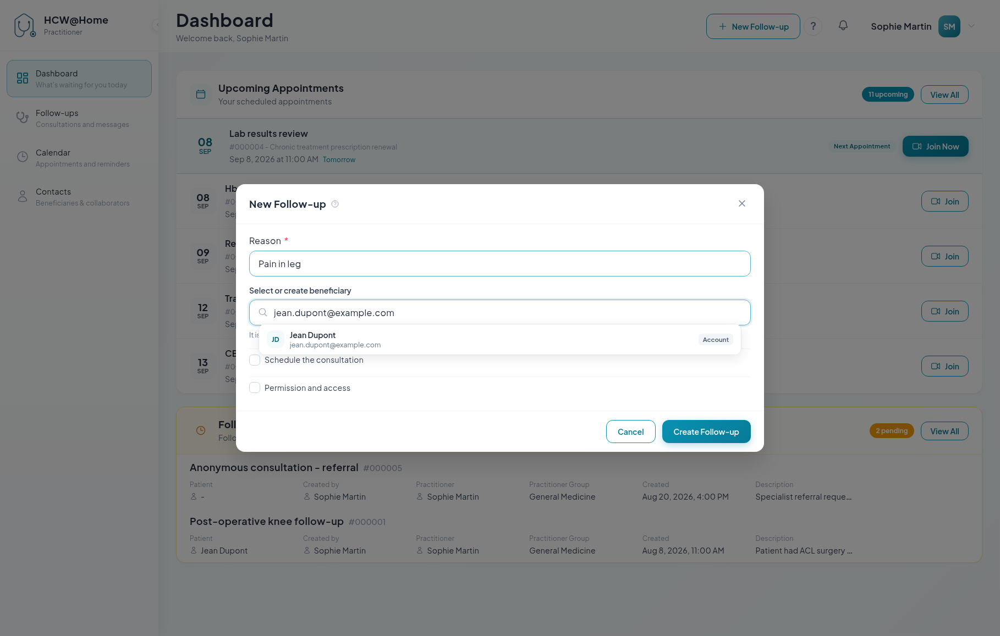

# Creating a Follow-up

A follow-up is the file that holds everything you exchange with a beneficiary.
Creating one takes a few seconds, and you can schedule the first appointment in
the same form.

## Open the form

Click **+ New Follow-up** in the header. The button is available from every
screen.

## Step 1 — Describe the follow-up

| Field | Notes |
|-------|-------|
| **Reason** *(required)* | Short title identifying the file, e.g. *Post-operative knee follow-up*. It is visible to the beneficiary. |
| **Select or create beneficiary** | Who the follow-up is about. Optional — an anonymous follow-up is perfectly valid. |

### The contact field

The beneficiary field is a single search box that both finds people and invites
new ones. Type a name, an email address or a mobile number and the drop-down
offers what applies:

| Entry | Result |
|-------|--------|
| An existing contact, tagged **Account** | Uses their account and their history |
| **Invite &lt;value&gt;** | Creates a temporary guest and sends them an access link by email, SMS or WhatsApp, depending on what you typed and on the channels your administrator enabled |
| **Invite &lt;value&gt; with a link** | Creates a guest but sends nothing — you copy the link and pass it on yourself |
| **Create contact &lt;value&gt;** | Opens the full contact form to create a permanent account |

Once someone is picked, a card shows their name and a tag — *Existing account*,
*Temporary guest* or *Link only* — plus how they will be reached. **Change**
swaps them for someone else.

For a guest, a **Contact details** block can be unfolded to add a first name, a
last name, a preferred language and a timezone. All optional, but the language
and the timezone are what localise their invitation and their reminders.

!!! tip "You do not have to use a real name"
    Any identifier you can recognise works — a case number, initials, a
    reference. Nothing forces you to enter identifying information, and the
    beneficiary can even be left empty.

## Step 2 — Schedule the consultation

Tick **Schedule the consultation** to reveal the appointment form. Leave it
unticked to create the file now and schedule later.

1. **Appointment Type** — **Video** for a teleconsultation, **In Person** for a
   physical visit. Video appointments get a call room and a join link;
   in-person ones only produce reminders.
2. **Summary** — optional, what the meeting is about.
3. **Date** and **Time** — or click **Now** to start immediately.
4. **Expected End Date / Time** — optional. Without it the appointment lasts the
   default duration set by your administrator (30 minutes out of the box). The
   expected end also defines how long participants can rejoin the call.

## Step 3 — Add the participants

You are added automatically, and so is the beneficiary. Click **Add
participant** for everyone else — a colleague, a specialist, an interpreter,
a relative. There is no limit.

The modal uses the same contact field as above: search for a colleague, or type
an email address or a mobile number to invite a guest.

It adds one checkbox: **Can see the consultation messages**. Tick it to give the
participant access to the follow-up chat and shared documents, before, during
and after the appointment. Leave it unticked for someone who should only attend
the call.

Click **+ Add this participant** to confirm, and repeat as needed.

!!! tip "Enable the chat unless confidentiality says otherwise"
    Without *Can see the consultation messages*, the participant cannot exchange
    anything before the call, cannot receive documents, and cannot use the chat
    during the call.

## Step 4 — Permissions and access

Tick **Permission and access** to reveal:

- **Responsible Practitioner** — assign the follow-up to a colleague instead of
  yourself
- **Practitioner group / shared queue** — attach it to a group, so every member
  can open it or assign it to themselves. Without a practitioner and without a
  group, you are the only one who can access the file.
- **Do not allow the patient to interact with the chat** — the beneficiary can
  still read the follow-up, but cannot send messages

## Create

Click **Create Follow-up**. Invitations go out immediately for participants
contacted by email, SMS or WhatsApp. For **link only** participants, open the
follow-up and copy their personal link — see
[Managing a Follow-up](manage-follow-up.md).

## The full form

**Edit** on an existing follow-up opens the same information as a three-step
form — *Details*, *Assignment*, *Schedule* — with two extra fields:

- **Description** — context for the follow-up, visible to the patient
- **Internal notes** — clinical notes visible to practitioners only, never shown
  to the patient

Your administrator may also have defined **custom fields**, which appear at the
end of the details step.
