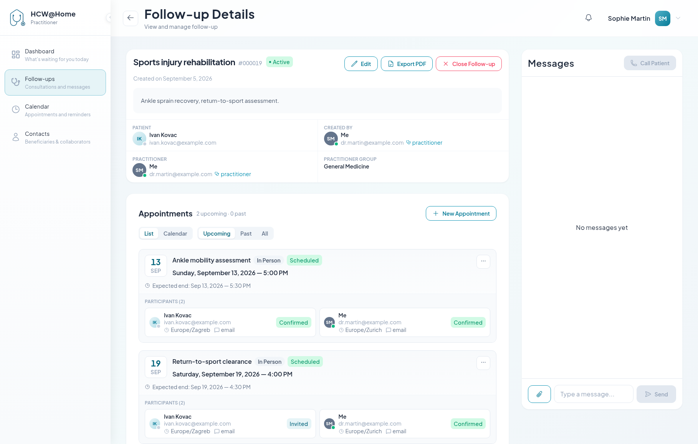

# Managing a Follow-up

## Find your follow-up

Go to **Follow-ups / Consultations**. Three tabs split your files:

| Tab | Contents |
|-----|----------|
| **Scheduled** | Open follow-ups with an upcoming appointment |
| **To handle** | Open follow-ups with no upcoming appointment — waiting on you |
| **Closed** | Finished files, read-only |

Use the search box, or **Advanced filters** to narrow by beneficiary, creator,
owning practitioner or group. Click a row to open it.

## The follow-up page

The page is built from three areas.

### Header and summary

The title, the follow-up number, the status badge and three actions:

- **Edit** — change the title, description, beneficiary, practitioner, group and
  permissions
- **Export PDF** — download the file: details, appointments, chat history
- **Close Follow-up** — see [Closing a Follow-up](closing-follow-up.md)

Below, the summary cards recall who created the file, which practitioner owns
it, who the beneficiary is and which practitioner group it belongs to.

### Appointments

Every appointment attached to the follow-up, with its date, type, status and
participants. The **List** / **Calendar** toggle changes the layout, and the
*Upcoming / Past / All* filter narrows the list.

**+ New Appointment** adds another meeting to the same follow-up — a check-up
two weeks later, for instance — reusing the same chat and the same documents.

On each appointment you can:

- **Send** — on a *Draft* appointment, send the invitations to the participants
- **Join** — enter the video room. The button becomes active shortly before the
  start time (10 minutes by default) and stays available for a while after the
  expected end, so a dropped call can be resumed. Too early, the platform tells
  you at what time you will be able to join.
- **More actions** (⋯) — **Edit** the date, the type or the participants, mark
  the appointment **Completed** or **No show** by hand, or **Cancel** it.
  Cancelling notifies the participants.

### Participants and invitation links

Each participant shows their contact channel, their timezone, their language and
their status: *Invited*, *Confirmed*, *Arrived*, *Cancelled*.

Participants invited with a link — no email, no SMS — display a **Copy access
link** button. Click it, then send the link through your own channel.

!!! warning "A personal link"
    Each link signs its holder into the application as that participant. Send it
    to that person only. Links have a limited lifetime — the expiry date is
    shown next to the link, and you can generate a fresh one at any time.

### Messages

The right-hand panel is the follow-up chat. It is available as soon as the file
exists, so you can prepare the consultation, and it stays available afterwards.

- Type in **Type a message…** and click **Send**
- Use the paperclip to attach a document, a photo or a report. The maximum size
  is set by your administrator (10 MB by default)
- Files are scanned for viruses before they are made available
- Messages can be edited or deleted; participants see that the message was
  edited or removed

Only participants with **Can see the consultation messages** — and the
beneficiary, unless the chat was disabled for them — can read this conversation.

!!! note "Direct call"
    **Call Patient**, at the top of the message panel, rings the beneficiary
    right away without scheduling anything. They receive an incoming call
    notification and can **Accept** or **Decline**.
