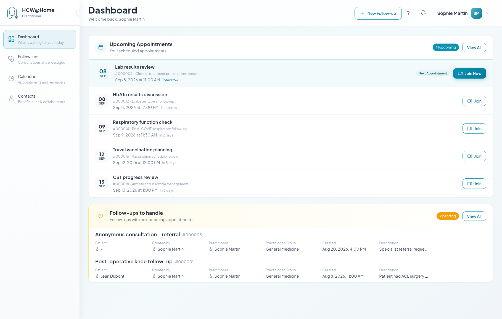

# Navigating the Platform

## The side menu

| Menu | What you find there |
|------|---------------------|
| **Dashboard** | Home screen: your next appointments and the follow-ups waiting for you |
| **Follow-ups** | All your follow-ups, split into *Scheduled*, *To handle* and *Closed* |
| **Calendar** | Appointments, reminders and bookable slots, in list or day/week/month view |
| **Contacts** | Your patients and collaborators, split into *Patients*, *Practitioners* and *All* |

The menu can be collapsed with the arrow next to the logo, to give more room to
the content.

## The dashboard

Two blocks make up the home screen:

- **Upcoming Appointments** — your scheduled appointments, most imminent first.
  The **Join** button appears on each one; the next appointment is highlighted
  with **Join Now** when its start time approaches.
- **Follow-ups to handle** — open follow-ups with no upcoming appointment. Use
  it as a to-do list: either schedule the next appointment, or close the file.

## The header

- **+ New Follow-up** — creates a follow-up from anywhere in the application
- **Notifications** (bell) — new messages, appointment changes, incoming calls.
  *Mark all read* clears the badge
- the question-mark button — replays the getting-started guide
- **Your name** — opens the menu with **My Profile** and **Sign out**

## Statuses at a glance

Follow-ups and appointments both carry a status badge.

| Object | Status | Meaning |
|--------|--------|---------|
| Follow-up | **Active** | Open — chat and appointments are available |
| Follow-up | **To handle** | Open but with no upcoming appointment |
| Follow-up | **Closed** | Finished; read-only, and subject to the retention delay |
| Appointment | **Draft** | Created but not sent to participants |
| Appointment | **Scheduled** | Confirmed, invitations sent |
| Appointment | **Completed** | The meeting took place |
| Appointment | **No show** | Nobody, or not enough participants, joined |
| Appointment | **Cancelled** | Called off; participants were notified |

Completed and no-show are set automatically after online appointments, unless
your administrator disabled that behaviour. You can always override them by hand
from the appointment's **More actions** menu.
