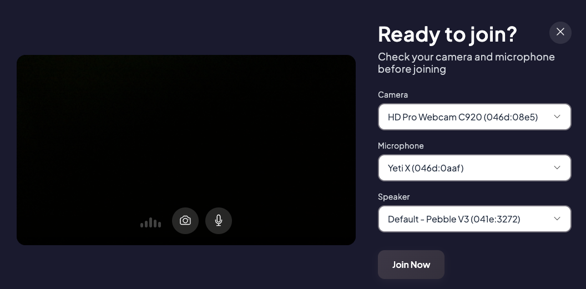
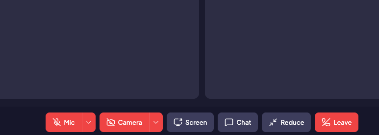
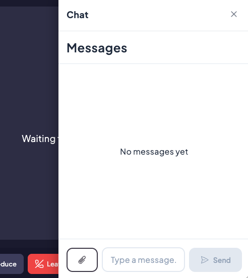

# Running a Video Consultation

## Join the call

Three places offer a **Join** button:

- the **Dashboard**, on each upcoming appointment (**Join Now** for the next one)
- the **Follow-up** page, on the appointment card
- the **Calendar**, on the appointment details

The button becomes active shortly before the scheduled time — 10 minutes by
default. Earlier than that, the platform tells you when you will be able to
join. After the meeting, rejoining stays possible for a short while past the
expected end, so an interrupted call can be resumed.

## Check your devices

Before entering the room, the lobby lets you verify your equipment.

Pick your **Camera**, **Microphone** and **Speaker**, check the preview and the
level meter, then click **Join Now**.

!!! warning "Browser permissions"
    The first time, your browser asks for access to the camera and the
    microphone. If you refuse, the lobby shows *Camera/microphone access was
    denied*: re-enable it in the browser's site settings and reload the page.

You can test your equipment outside of any consultation from **My Profile >
System Test**.

## The in-call controls

| Control | What it does |
|---------|--------------|
| **Mic** | Mute / unmute. The arrow next to it switches microphone |
| **Camera** | Turn the video on / off. The arrow switches camera |
| **Background blur** | Blur what is behind you, when your device supports it |
| **Screen** | Share your screen — see below |
| **Record** | Record the session, when your administrator enabled it |
| **Participants** | Panel listing everyone, to add or remove someone mid-call |
| **Chat** | Open the conversation panel, with an unread badge |
| **Reduce** | Shrink the call window to browse the platform without hanging up |
| **Leave** | Leave the call |

Participants appear as tiles; someone with their camera off shows as *Camera
off*, and a muted microphone is marked on their tile. As a moderator you can
mute a noisy participant from their tile — they have to unmute themselves again.

## Share your screen

1. Click **Screen**
2. Your browser asks what to share: a **tab**, a **window** or the **entire
   screen**. Pick it and click **Share**
3. The shared content appears in the call, framed, and labelled *Your screen*
4. Click **Screen** again, or the browser's **Stop sharing** banner, to end it

!!! note "System permissions"
    On macOS and Windows, screen sharing may also require you to authorise your
    browser in the operating system's privacy settings. Grant it once, then
    restart the browser.

## Chat during the call

**Chat** opens the follow-up conversation next to the video: the same history,
the same attachments, before, during and after the call. Anything sent here is
still there once the call is over.

The chat is only available for participants who have **Can see the consultation
messages**.

## Recording and transcription

When your administrator has enabled them:

- **Record** starts and stops the session recording. The file is posted in the
  follow-up chat shortly after you stop it.
- **Captions** turns on live transcription. The transcript is posted in the chat
  in the same way.

!!! warning
    Recording and transcription are regulated by your local rules. Inform every
    participant and get their consent before you start.

## Leave the call

Click **Leave**. The call ends once everyone has left; anyone still in the room
stays connected.

If you close the browser tab while still in a call, the platform asks you to
confirm — leaving the page disconnects you.
